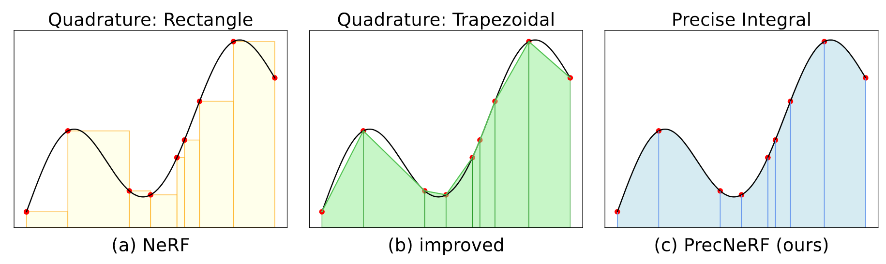
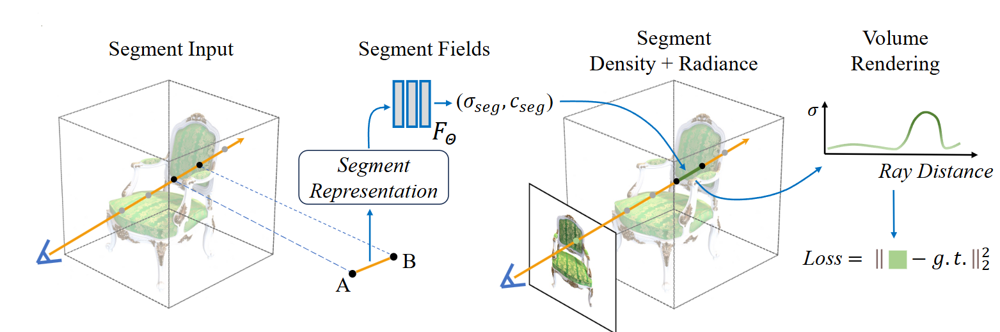
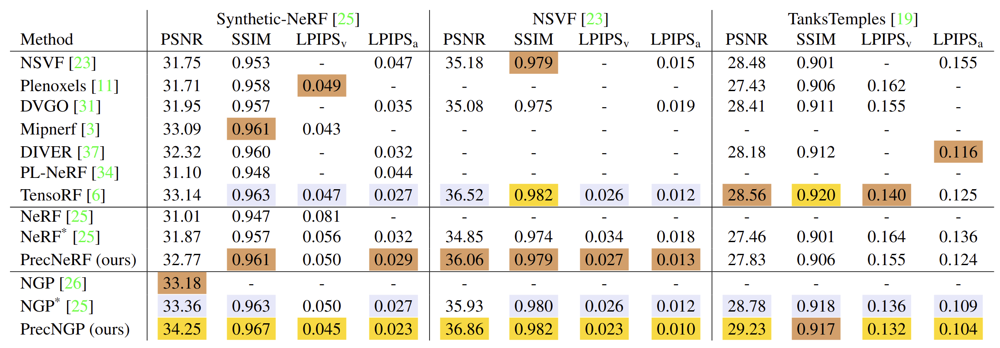

<p align="center">
    
</p>

<h1 align="center"> 
    <a>PrecNeRF</a>
</h1>

<a href=""></a>

> **Precise Integral in NeRFs: Overcoming the Approximation Errors of Numerical Quadrature** \
> [Boyuan Zhang](https://github.com/Moreland-cas)<sup>1</sup>, [Zhenliang He](https://lynnho.github.io)<sup>1</sup>, [Meina Kan](https://scholar.google.is/citations?user=4AKCKKEAAAAJ)<sup>1,2</sup>, [Shiguang Shan](https://scholar.google.com/citations?user=Vkzd7MIAAAAJ)<sup>1,2</sup> \
> <sup>1</sup>Key Lab of AI Safety, Institute of Computing Technology, CAS, China \
> <sup>2</sup>University of Chinese Academy of Sciences, China

<p align="center">
    
</p>

We propose a simple yet effective segment representation to relieve the approximation errors of numerical quadrature in NeRFs.

## Quantitative Results
<p align="center">
    
</p>

## Datesets

We use several public datasets (nerf_synthetic, Synthetic_NSVF, TanksAndTemple, 360v2, multiscale) to train/evaluate our precise integral methods versus quadrature methods(original NeRFs). Please refer to the original website and repository ([NeRF Synthetic](https://www.kaggle.com/datasets/nguyenhung1903/nerf-synthetic-dataset), [NSVF](https://github.com/facebookresearch/NSVF), [multiscale, 360v2](https://github.com/hturki/pynerf/tree/main)) to download the data and organize the data structure as:
```
/Precise-NeRF
    /data
        /nerf_synthetic
        /NSVF
            /Synthetic_NSVF
            /TanksAndTemple
        /multiscale # multiscale nerf synthetic
        /360v2
        /360_extra
```
Then add soft links to the respective subfolders,
```
cd /Precise-NeRF
ln -s ./data ./NeRF_related/data
ln -s ./data ./NGP_related/data
ln -s ./data ./PyNeRF_related/PyNeRF/data
ln -s ./data ./PyNeRF_related/PrecPyNeRF/data
```
The codes for NeRF/PrecNeRF, NGP/PrecNGP, PyNeRF/PrecPyNeRF are in the folders NeRF_related, NGP_related, PyNeRF_related respectively.

## NeRF-related

### Environment Setup

We refer to [nerfstudio](https://github.com/nerfstudio-project/nerfstudio) as our framework to implement PrecNeRF. First setup the conda environment:

```
conda create --name nerfstudio -y python=3.8
pip install torch==2.1.2+cu118 torchvision==0.16.2+cu118 --extra-index-url https://download.pytorch.org/whl/cu118
conda install -c "nvidia/label/cuda-11.8.0" cuda-toolkit
export TCNN_CUDA_ARCHITECTURES=86
pip install ninja git+https://github.com/NVlabs/tiny-cuda-nn/#subdirectory=bindings/torch
```

Then install [nerfstudio](https://github.com/nerfstudio-project/nerfstudio) and PrecNeRF as:

```
git clone https://github.com/Moreland-cas/PrecNeRF
conda activate nerfstudio
cd Precise-NeRF/NeRF_related/nerfstudio
pip install -e .
cd ../SegNeRF # here SegNeRF equals to PrecNeRF
pip install -e .
```

### Training

We use the `ns-train` command provided by nerfstudio to train NeRF and PrecNeRF.

#### nerf_synthetic

```
cd Precise-NeRF/NeRF_related
ns-train vanilla-nerf --output-dir path_to_outputs --data ./data/nerf_synthetic/xxx
ns-train segnerf --output-dir path_to_outputs --data ./data/nerf_synthetic/xxx
```

#### Synthetic_NSVF

```
cd Precise-NeRF/NeRF_related
ns-train vanilla-nerf --output-dir path_to_outputs --data ./data/NSVF/Synthetic_NSVF/xxx
ns-train segnerf nsvf --output-dir path_to_outputs --data ./data/NSVF/Synthetic_NSVF/xxx
```

#### TanksAndTemple

```
cd Precise-NeRF/NeRF_related
ns-train vanilla-nerf --output-dir path_to_outputs --data ./data/NSVF/TanksAndTemple/xxx
ns-train segnerf --output-dir path_to_outputs --data ./data/NSVF/TanksAndTemple/xxx
```

Note: When training on nerf_synthetic, the config used for `dataparser` should be `BlenderDataParserConfig()`, whereas `NsvfDataParserConfig()` for Synthetic_NSVF and TanksAndTemple.

### Evaluation

We use the `ns-eval` command to evaluate the trained models.

```
ns-eval --load_config path_to_outputs/your_model/configs.yaml --output_path path_to_dump
```

## NGP-related

### Environment Setup

We refer to [nerfacc](https://github.com/nerfstudio-project/nerfacc) as our framework to implement NGP/PrecNGP. First setup the conda environment:

```
conda create --name nerfacc -y python=3.8
pip install torch==2.1.2+cu118 torchvision==0.16.2+cu118 --extra-index-url https://download.pytorch.org/whl/cu118
conda install -c "nvidia/label/cuda-11.8.0" cuda-toolkit
export TCNN_CUDA_ARCHITECTURES=86
pip install ninja git+https://github.com/NVlabs/tiny-cuda-nn/#subdirectory=bindings/torch
```

Then install [nerfacc](https://github.com/nerfstudio-project/nerfacc) as:

```
cd Precise-NeRF/NGP_related
conda activate nerfacc
pip install -e .
```

### Training & Evaluation

#### nerf_synthetic

Run the scripts in `NGP_related` to train NGP and PrecNGP, the trained model checkpoints are saved in `NGP_related/ckpts` and the evaluation results are saved as txts in `NGP_related/logs_txt`.

```
cd Precise-NeRF/NGP_related
./run_all_blender.sh
./run_all_blender_seg.sh
```

## PyNeRF-related

### Environment Setup

We refer to [pynerf](https://github.com/hturki/pynerf/tree/main) as our framework to implement PyNeRF/PrecPyNeRF. 
First setup the conda environment for pynerf:

```
conda create --name pynerf -y python=3.8
pip install torch==2.1.2+cu118 torchvision==0.16.2+cu118 --extra-index-url https://download.pytorch.org/whl/cu118
conda install -c "nvidia/label/cuda-11.8.0" cuda-toolkit
export TCNN_CUDA_ARCHITECTURES=86
pip install ninja git+https://github.com/NVlabs/tiny-cuda-nn/#subdirectory=bindings/torch
cd Precise-NeRF/PyNeRF_related/PyNeRF
pip install -e .
```

Then setup the conda environment for precpynerf:

```
conda create --name precpynerf -y python=3.8
pip install torch==2.1.2+cu118 torchvision==0.16.2+cu118 --extra-index-url https://download.pytorch.org/whl/cu118
conda install -c "nvidia/label/cuda-11.8.0" cuda-toolkit
export TCNN_CUDA_ARCHITECTURES=86
pip install ninja git+https://github.com/NVlabs/tiny-cuda-nn/#subdirectory=bindings/torch
cd Precise-NeRF/PyNeRF_related/PrecPyNeRF
pip install -e .
```

### Training

Run the scripts in `PyNeRF_related/PyNeRF` and `PyNeRF_related/PrecPyNeRF` respectively to train  PyNeRF and PrecPyNeRF.

#### nerf_synthetic

```
cd Precise-NeRF/PyNeRF_related/PyNeRF
./run_all_blender_vanilla.sh
cd Precise-NeRF/PyNeRF_related/PrecPyNeRF
./run_all_blender_seg.sh
```

#### 360v2

```
cd Precise-NeRF/PyNeRF_related/PyNeRF
./run_all_360v2_vanilla.sh
cd Precise-NeRF/PyNeRF_related/PrecPyNeRF
./run_all_360v2_seg.sh
```

### Evaluation
Since [pynerf](https://github.com/hturki/pynerf/tree/main) is built on [nerfstudio](https://github.com/nerfstudio-project/nerfstudio), use `ns-eval` to evaluate the trained models.
```
ns-eval --load_config path_to_outputs/your_model/configs.yaml --output_path path_to_dump
```

## Acknowledgement
This project is built upon nerfstudio, nerfacc, and pynerf. Thanks for their great work!

- nerfstudio: https://github.com/nerfstudio-project/nerfstudio
- nerfacc: https://github.com/nerfstudio-project/nerfacc
- pynerf: https://github.com/hturki/pynerf/tree/main

## Citation

If you find [PrecNeRF](https://github.com/Moreland-cas/Precise-NeRF) useful in your research works, please consider citing:

```
@inproceedings{zhang2025precnerf,
    title={Precise Integral in NeRFs: Overcoming the Approximation Errors of Numerical Quadrature},
    author={Zhang, Boyuan and He, Zhenliang and Kan, Meina and Shan, Shiguang},
    booktitle={IEEE/CVF Winter Conference on Applications of Computer Vision (WACV)},
    year={2025}
}
```
